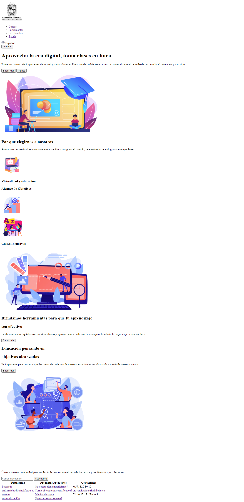
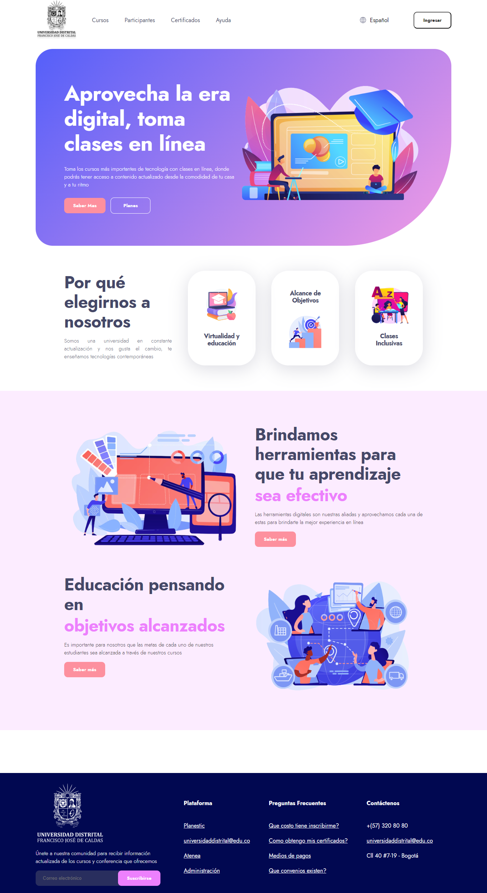
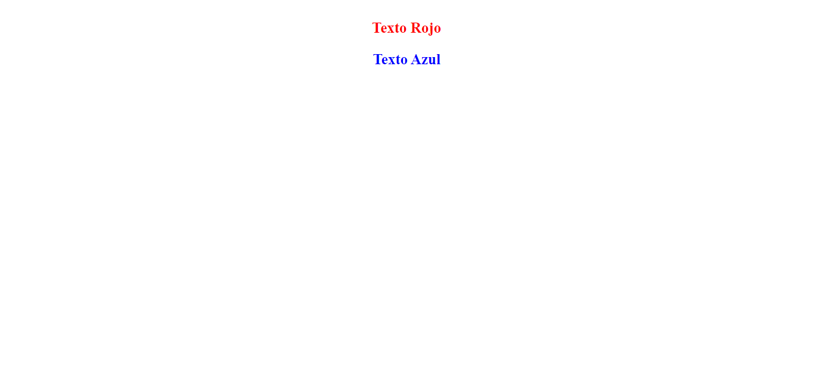
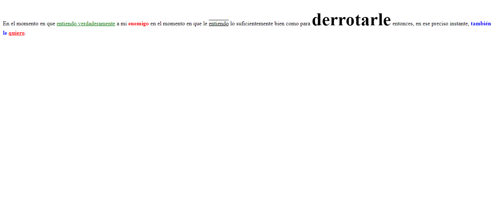
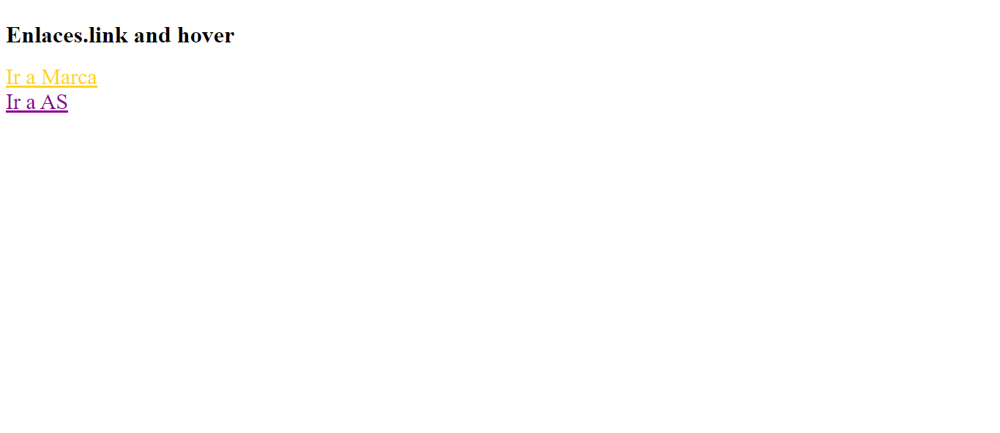
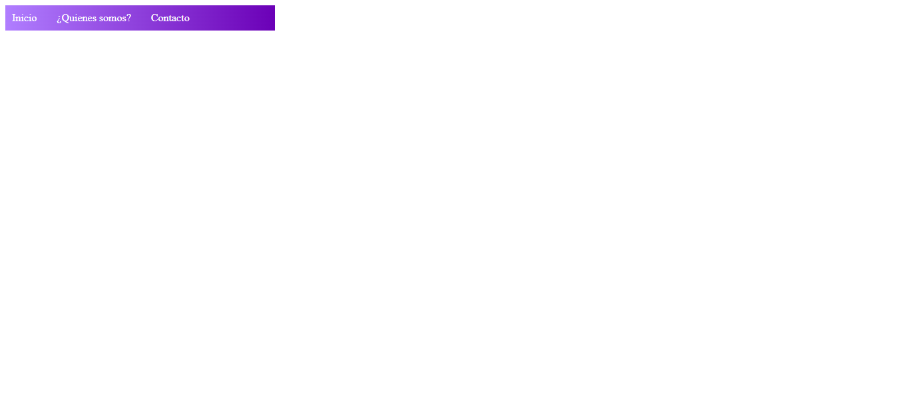
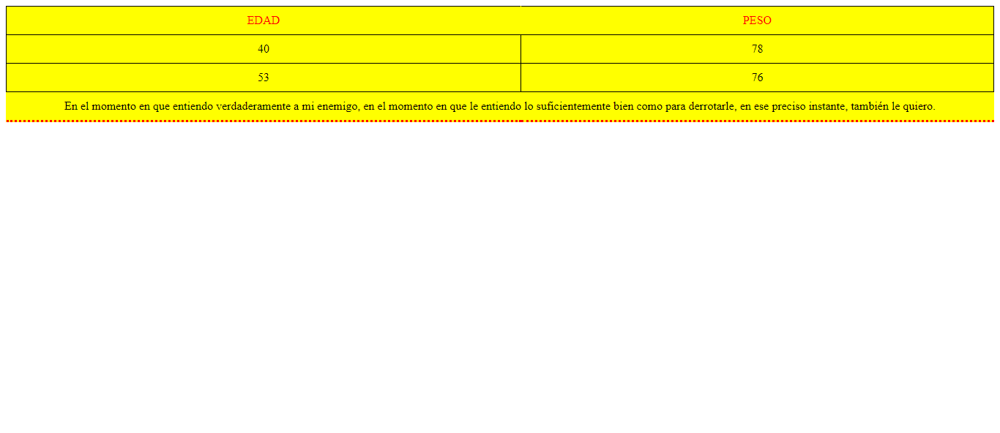

<h1> Taller 9: Maria Paula Mogollón Raigoso </h1>

<h2> Información </h2>

Curso: Full Stack Básico - Grupo 1 

Profesor: Cristian Patiño 

<h2>Punto 1: Link de Figma </h2>
<a href="https://www.figma.com/file/vDEY0FFPSQP4K99OevSmjx/Maria-Paula-Mogollon---Figma-Exercise?type=design&node-id=6%3A249&mode=design&t=6EQqqCrIABhAkiH6-1">Link de Figma </a>

<a href= ""> Link menu </a>

<h2>Punto 2: HTML </h2>

<h2> Punto 3: CSS </h2>

<h2> Punto 4: Titulos </h2>

<h2> Punto 5: Estilos de texto</h2>

<h2> Punto 6: Enlaces </h2>

<h2> Punto 7-8: Navegacion </h2>

<h2> Punto 9: Tablas </h2>
